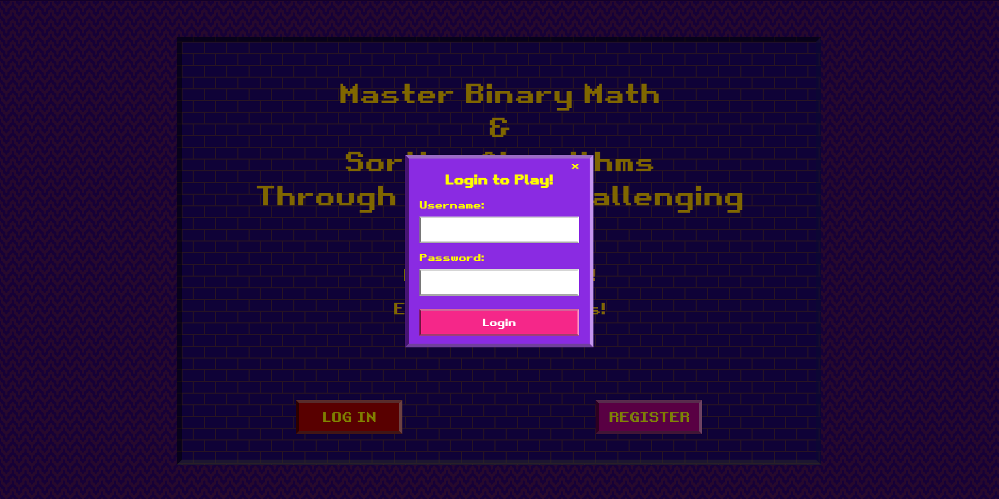
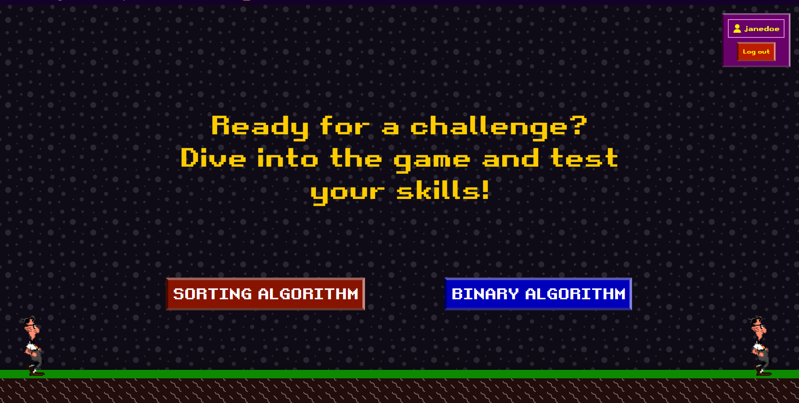
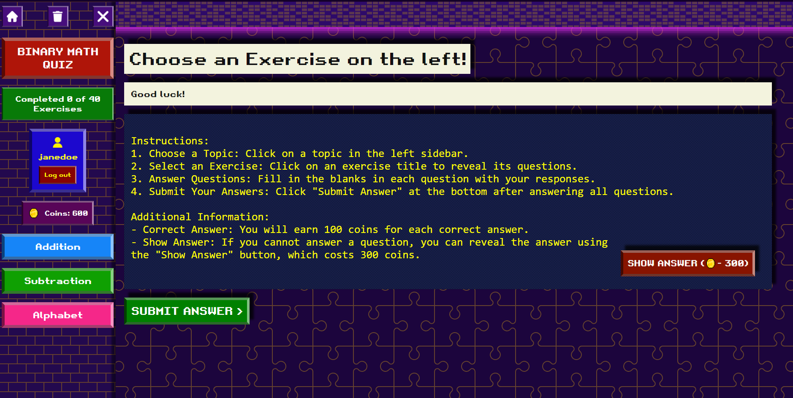
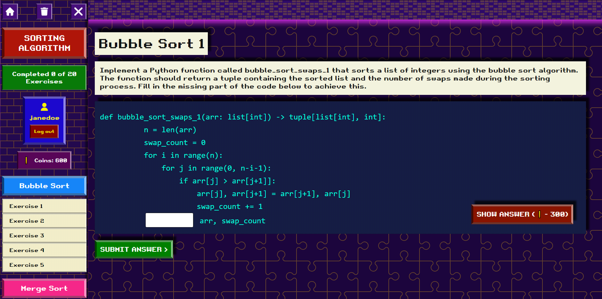

# 2nd year Software Engineering Prototype

A Software Engineering 1 Project presented to the faculty of Department of Computing and Informatics of the City College of Calamba

Mastering Sorting Algorithms and Binary Operations : A Web-based game learning system

Bachelor of Science in Computer Science

#Prototype Overview: 
 The prototype is a web-based quiz game designed to teach sorting algorithms and binary calculations, featuring 
a pixelated game theme with animated backgrounds. It consists of two main sections accessible from the front page: 
Sorting Algorithm and Binary Calculation. Upon clicking either option, the user is directed to a corresponding HTML 
page. Each exercise details such as (questions, answers and instructions) are stored in an array of objects in JavaScript 
named binary-question.js and sorting-question.js 

#User Interface Design: 
The interface adopts a pixelated game theme, with animated backgrounds created using patterns from Hero 
Patterns. The sidebar includes navigation options, such as a Home icon to return to the previous page, a bin icon to reset 
the score, and an X icon to hide the sidebar. Additionally, there's a container displaying the selected topic (e.g., Sorting 
Algorithm) and a progress indicator showing the completion status of exercises (e.g., "Completed 0 out of 20 exercises"). 
Users can select specific topics within the chosen category, such as Bubble Sort or Insertion Sort, from a dropdown 
menu. 

#Interaction Flow: 
1. After login, users select either Sorting Algorithm or Binary Calculation. 
2. Upon selection, users are redirected to the corresponding HTML page. 
3. On the chosen page, users can select a specific topic (e.g., Bubble Sort). 
4. The exercises related to the selected topic appear in a dropdown menu. 
5. Users can choose an exercise from the dropdown, which automatically displays the exercise number, 
instructions, and question in the main content area. 
6. Users input their answers in the provided input field and click the "Submit Answer" button. 
7. If the answer is correct, a JavaScript alert notifies the user of their success; otherwise, a different alert 
indicates an incorrect answer.

#Implementation Details: 
The prototype is developed using HTML, CSS, and JavaScript, incorporating pixelated game graphics and 
animated backgrounds. 
Navigation between pages is achieved through HTML hyperlinks. 
Exercise topics and questions are dynamically loaded based on user selections using JavaScript.  User input 
validation and feedback are implemented using JavaScript alerts

# Test account for login
username : janedoe,johndoe
password : 123

# NOTE! if installing in XAMPP
Create a folder named prototype and put all the files inside.
change the db.php base on your database config.

# Page Overview

-------------------------------------------

-------------------------------------------

-------------------------------------------

